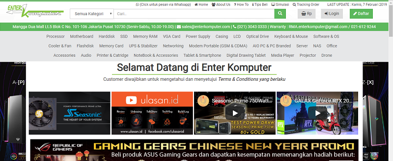
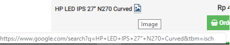
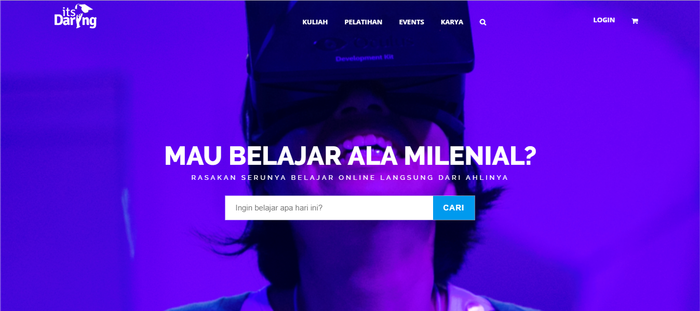
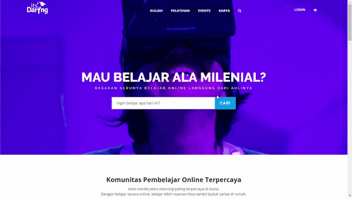
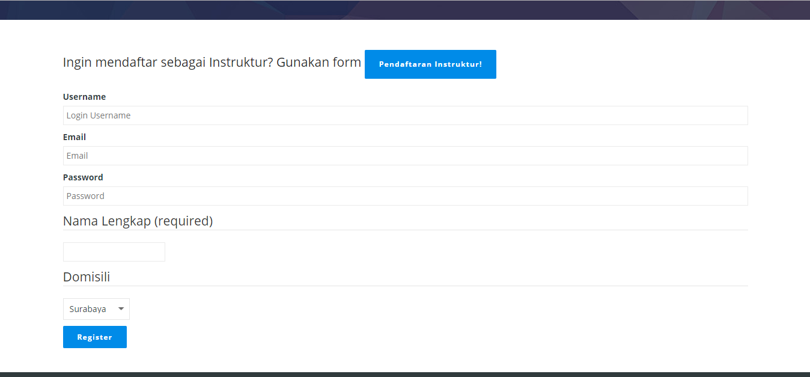
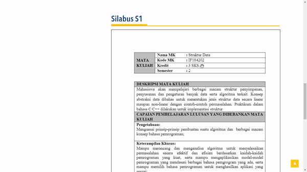

# Examples of Product with Bad UI <!-- omit in toc -->

Name  : Dandy Naufaldi \
NRP   : 05111640000011 \
Class : A

# Table of Contents <!-- omit in toc -->
- [1. EnterKomputer Website](#1-enterkomputer-website)
  - [1.1 Bad UI Aspects](#11-bad-ui-aspects)
  - [1.2 Suggestions](#12-suggestions)
  - [1.3 Video](#13-video)
- [2. itsDaring Website](#2-itsdaring-website)
  - [2.1 Bad UI Aspects](#21-bad-ui-aspects)
  - [2.2 Suggestions](#22-suggestions)
  - [2.3 Video](#23-video)
- [3. Department of Informatics ITS Website](#3-department-of-informatics-its-website)
  - [3.1 Bad UI Aspects](#31-bad-ui-aspects)
  - [3.2 Suggestions](#32-suggestions)
  - [3.3 Video](#33-video)
## 1. EnterKomputer Website
#### [Back to Table of Contents](#table-of-contents-) <!-- omit in toc -->
[**enterkomputer.com**](enterkomputer.com) is a website owned by *EnterKomputer*, a computer parts store, which is used for their online shopping platform. The homepage looks like the picture below

I want to highlight the product listing view when whe choose one of the available product categories from navigation bar. For example, the "LCD" menu section (actually they're all LED display monitor). It looks like this. All of the products are listed in a table. Containing only product name and price. They're separated only based on their brand.

### 1.1 Bad UI Aspects
  - **No custom filter or sort for user** \
    Without additional filter and sort, it will be hard for user to get spesific information about product quickly. They may want to only look for products from certain brand, or see the product sorted from the lowest price, etc. Instead, user has to read through all the product lists.
  - **No image for product** \
    Instead of providing image for each of their product, they only give auto-generated URL linked to goole search to show relevant images based on the products name. 
     \
    We have to spend extra time to know what the product looks like.
### 1.2 Suggestions
  - **Add sidebar for custom filter and sort** \
    By adding custom filter, potential buyer can filter out irrelevant product based on their preferences. For display monitor products, the filters may include brand, display size, display type, curved, and price range. Custom sort is needed to help user get information in the order they wanted. Custom sort may consist of sort by lowest price or highest price and sort by top selling products.
  - **Use card-like box for product information** \
    By using card-like box, EnterKomputer can attach the image of the products. So that, user can easily see what the product looks like without leaving the website.
### 1.3 Video

## 2. itsDaring Website
#### [Back to Table of Contents](#table-of-contents-) <!-- omit in toc -->
[**itsdaring.id**](itsdaring.id) is an online course platform made by PT ITS Tekno Sains to facilitate e-learning in various department. Using this website, lecturer and students can easily set up an online class, where they can share teaching matherials and giving assignment. The homepage look like the image below.

Here, I want to highlight the sign up feature.
### 2.1 Bad UI Aspects
- **Location of button to access sign up page** \
  From  homepage view like in the above image, can you figure out how you can sign up? There is no button or hyperlink with `sign up` written on it. Actually, to access sign up page you have to click on the "Login" button first. It will redirect you to a login page. Then, you will see a button redirecting to sig up page.
  

- **Untidy and unintuitive sign up form** \
  Following the first bad UI aspect, the sign up form is **untidy** and **unintuitive**.
  
  We can see that the labels for form input have different size. Also, there is no password confirmation which may help us from misstyping (*typo*) our password. All of the required field has no direct html validation (using `required` attribute) that make user to submit the form first to get the error message.
  
### 2.2 Suggestions
- **Add "Signup" text next to "Login" text** \
  Adding simple text as "Signup" into the login button will instantly tell user that they can access signup page from that button
- **Tidy up and add required attribute in sign up form inputs** \
  Recheck the font size of form labels. So that, they all have same size. Then, add `required` attribute to relevant input to help user know that the field is required. We can also add a red star "*" next to form label to mark required field.
### 2.3 Video

## 3. Department of Informatics ITS Website
[**its.ac.id/informatika**](https://www.its.ac.id/informatika) is the new website for Department of Informatics ITS. It follow new design that is applied to myITS website. The homepage looks like image below.

Here, I want to highlight the section which show the curriculum and syllabus for Department of Informatics [link](https://www.its.ac.id/informatika/akademik/kurikulum-silabus-s1)
#### [Back to Table of Contents](#table-of-contents-) <!-- omit in toc -->
### 3.1 Bad UI Aspects
- **PDF viewer with poor feature** \
  The PDF viewer used in the website to view PDF online really put difficulties at user.
  
  We can see that it shows the **document** with its **full height** instead of set it proportionally to the browser window. It has **no scrolling** support. So, after we click the next page button, we need to scroll back to the top again to read the top part of current page. There is also **no search** support to search term through the document. So, the only way to read the document comfortably is by downloading it and view it using our own PDF viewer.
### 3.2 Suggestions

### 3.3 Video