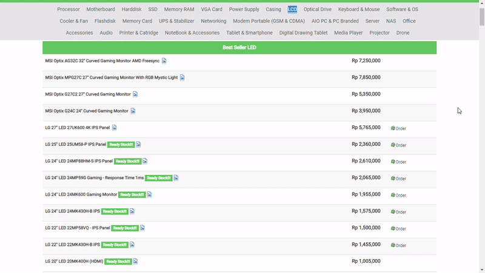

# Examples of Product with Bad UI <!-- omit in toc -->

Name  : Dandy Naufaldi  
NRP   : 05111640000011  
Class : A

# Table of Contents <!-- omit in toc -->
- [1. EnterKomputer Website](#1-enterkomputer-website)
  - [1.1 Bad UI Aspects](#11-bad-ui-aspects)
  - [1.2 Suggestions](#12-suggestions)
  - [1.3 Video](#13-video)
- [2. itsDaring Website](#2-itsdaring-website)
  - [2.1 Bad UI Aspects](#21-bad-ui-aspects)
  - [2.2 Suggestions](#22-suggestions)
  - [2.3 Video](#23-video)
- [3. Department of Informatics ITS Website](#3-department-of-informatics-its-website)
  - [3.1 Bad UI Aspects](#31-bad-ui-aspects)
  - [3.2 Suggestions](#32-suggestions)
  - [3.3 Video](#33-video)

## 1. EnterKomputer Website
#### [Back to Table of Contents](#table-of-contents----omit-in-toc) <!-- omit in toc -->
[**enterkomputer.com**](enterkomputer.com) is a website owned by *EnterKomputer*, a computer parts store, which is used for their online shopping platform. The homepage looks like the picture below
 

 
I want to highlight the product listing view when whe choose one of the available product categories from navigation bar. For example, the "LCD" menu section (actually they're all LED display monitor). It looks like this. All of the products are listed in a table. Containing only product name and price. They're separated only based on their brand.

 
### 1.1 Bad UI Aspects
  - **No custom filter or sort for user**  
    Without additional filter and sort, it will be hard for user to get spesific information about product quickly. They may want to only look for products from certain brand, or see the product sorted from the lowest price, etc. Instead, user has to read through all the product lists.
  - **No image for product**  
    Instead of providing image for each of their product, they only give auto-generated URL linked to goole search to show relevant images based on the products name. 
     
    
     
    We have to spend extra time to know what the product looks like.
### 1.2 Suggestions
  - **Add sidebar for custom filter and sort**  
    By adding custom filter, potential buyer can filter out irrelevant product based on their preferences. For display monitor products, the filters may include brand, display size, display type, curved, and price range. Custom sort is needed to help user get information in the order they wanted. Custom sort may consist of sort by lowest price or highest price and sort by top selling products.
  - **Use card-like box for product information**  
    By using card-like box, EnterKomputer can attach the image of the products. So that, user can easily see what the product looks like without leaving the website.
### 1.3 Video
Coming soon

## 2. itsDaring Website
#### [Back to Table of Contents](#table-of-contents----omit-in-toc) <!-- omit in toc -->
[**itsdaring.id**](itsdaring.id) is an online course platform made by PT ITS Tekno Sains to facilitate e-learning in various department. 
### 2.1 Bad UI Aspects
### 2.2 Suggestions
### 2.3 Video

## 3. Department of Informatics ITS Website
#### [Back to Table of Contents](#table-of-contents----omit-in-toc) <!-- omit in toc -->
### 3.1 Bad UI Aspects
### 3.2 Suggestions
### 3.3 Video